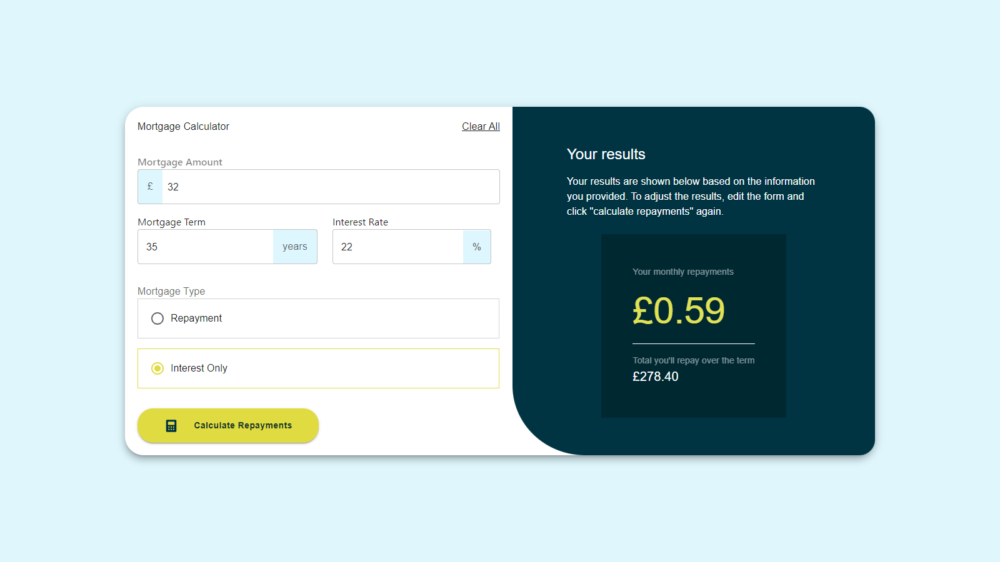

# Frontend Mentor - Mortgage repayment calculator solution

This is a solution to the [Mortgage repayment calculator challenge on Frontend Mentor](https://www.frontendmentor.io/challenges/mortgage-repayment-calculator-Galx1LXK73). Frontend Mentor challenges help you improve your coding skills by building realistic projects.

## Table of contents

- [Overview](#overview)
  - [The challenge](#the-challenge)
  - [Screenshot](#screenshot)
- [My process](#my-process)

  - [Built with](#built-with)
  - [What I learned](#what-i-learned)
  - [Continued development](#continued-development)

- [Author](#author)
- [Acknowledgments](#acknowledgments)

**Note: Delete this note and update the table of contents based on what sections you keep.**

## Overview

### The challenge

Users should be able to:

- Input mortgage information and see monthly repayment and total repayment amounts after submitting the form
- See form validation messages if any field is incomplete
- Complete the form only using their keyboard
- View the optimal layout for the interface depending on their device's screen size
- See hover and focus states for all interactive elements on the page

### Screenshot

### Links

- Solution URL: [Add solution URL here](https://www.frontendmentor.io/solutions/mortgage-calculator-y585aHyhRK)
- Live Site URL: [Add live site URL here](https://mortgaege.netlify.app/)

## My process

### Built with

- Project IDX
- [React](https://reactjs.org/) - JS library
- Material Ui

### What I learned

I'm really happy with how quickly I'm picking up Zustand for state management! Here's an example of how I'm using it to store and update values in my application:

import { create } from "zustand";
const AppStore = create((set) => ({
  calculate: true,
  setCalculate: (calculate) => set({ calculate }),
  mortgageAmount: "",
  setMortgageAmount: (mortgageAmount) => set({ mortgageAmount }),
  mortgageTerm: "",
  setMortgageTerm: (mortgageTerm) => set({ mortgageTerm }),
  interestRate: "",
  setInterestRate: (interestRate) => set({ interestRate }),
  mortgageType: "repayment",
  setMortgageType: (mortgageType) => set({ mortgageType }),
  monthlyPayment: 0,
  setMonthlyPayment: (monthlyPayment) => set({ monthlyPayment }),
  totalRepayment: 0,
  setTotalRepayment: (totalRepayment) => set({ totalRepayment }),
}));
export default AppStore;

### Continued development

I am currently building a Spotify Clone app so yeah i am learning alot really quick. Getting a good hands on Zustand more.

## Author

- Website - [Adebimpe Favour](https://www.your-site.com)
- Frontend Mentor - [@yourusername](https://www.frontendmentor.io/profile/yourusername)

